<a id="readme-top"></a>

<!-- PROJECT LOGO -->
<br />
<div align="center">
  <a href="https://github.com/Joelheile/RunningFinder">
    
  </a>

  <h1 align="center">Running Finder</h1>

  <p align="center">
    An open-source platform connecting runners with local running clubs
    <br />
    <a href="https://github.com/Joelheile/RunningFinder"><strong>Explore the docs »</strong></a>
    <br />
    <br />
    <a href="https://runningfinder.com">View Demo</a>
    ·
    <a href="https://github.com/Joelheile/RunningFinder/issues">Report Bug</a>
    ·
    <a href="https://github.com/Joelheile/RunningFinder/issues">Request Feature</a>
  </p>
</div>

<!-- TABLE OF CONTENTS -->
<details>
  <summary>Table of Contents</summary>
  <ol>
    <li>
      <a href="#about-the-project">About The Project</a>
      <ul>
        <li><a href="#built-with">Built With</a></li>
      </ul>
    </li>
    <li>
      <a href="#getting-started">Getting Started</a>
      <ul>
        <li><a href="#installation">Installation</a></li>
      </ul>
    </li>
    <li><a href="#entity-relationship-er-diagram">ER Model</a></li>
    <li><a href="#roadmap">Roadmap</a></li>
       <li><a href="#static-code-analysis">Static Code Analysis</a></li>
    <li><a href="#contributing">Contributing</a></li>
    <li><a href="#license">License</a></li>
    <li><a href="#contact">Contact</a></li>
    <li><a href="#acknowledgments">Acknowledgments</a></li>
  </ol>
</details>

<!-- ABOUT THE PROJECT -->

## 🚀 About The Project

Running Finder is a platform that helps runners discover and connect with running clubs and events in their area. The application displays running clubs and events on an interactive map, allowing users to filter by preferences like distance, weekday, or difficulty.

### Key Features

- **Interactive Map**: View running clubs and events plotted on Google Maps
- **Advanced Filtering**: Find runs by distance, weekday, and difficulty level
- **Club Discovery**: Browse and join local running clubs
- **Event Registration**: Register for upcoming runs directly through the platform
- **Authentication**: Sign in with GitHub or email to save preferences and manage registrations

### Built With

- [Next.js](https://nextjs.org/) - React framework with server-side rendering
- [React](https://reactjs.org/) - Frontend library for building user interfaces
- [Drizzle ORM](https://drizzle.team/) - TypeScript ORM for SQL databases
- [TailwindCSS](https://tailwindcss.com/) - Utility-first CSS framework
- [Neon](https://neon.tech/) - Serverless Postgres database
- [Shadcn UI](https://ui.shadcn.com/) - Reusable component library
- [Jest](https://jestjs.io/) & [Playwright](https://playwright.dev/) for testing

## 🚦 Getting Started

### Prerequisites

- Node.js (v18 or higher)
- pnpm
  ```sh
  npm install -g pnpm
  ```
- Postgres database (or use the provided Docker setup)

### Installation

1. Clone the repository

   ```sh
   git clone https://github.com/Joelheile/RunningFinder.git
   cd RunningFinder
   ```

2. Install dependencies

   ```sh
   pnpm install
   ```

3. Create a `.env.local` file based on `.env.example` and add your API keys

   ```sh
   cp .env.example .env.local
   ```

4. Set up the database

   ```sh
   # For development with Docker
   sh docker_run.sh

   # Generate database schema
   pnpm dev:generate
   pnpm dev:push

   # Seed the database (optional)
   pnpm dev:seed
   ```

5. Start the development server

   ```sh
   pnpm dev
   ```

6. Access the API documentation at http://localhost:3000/docs

## 🗂️ Project Structure

```
runningfinder/
├── src/                   # Source code
│   ├── app/               # Next.js app router pages
│   ├── components/        # React components
│   ├── lib/               # Utilities, hooks, and business logic
│   │   ├── authentication/# Auth configuration
│   │   ├── db/            # Database schema and connections
│   │   └── types/         # TypeScript type definitions
├── public/                # Static assets
├── tests/                 # Test files
├── drizzle/               # Database migrations
└── playwright-tests/      # End-to-end tests
```

## 🧪 Testing

Run all tests with:

```sh
pnpm tests
```

Or run specific test suites:

```sh
# Unit tests
pnpm jest unit

# Integration tests
pnpm jest integration

# End-to-end tests
npx playwright test
```

## 🛣️ Roadmap

- [ ] Combine Google Maps marker dragging and place search
- [ ] Enhance club dashboard with role-based permissions
  - [ ] Page editing
  - [ ] Membership management
  - [ ] Registration management
- [ ] Support for additional sport types
- [ ] Weather API integration for run forecasts
- [ ] Strava API integration for syncing runs

See the [open issues](https://github.com/Joelheile/RunningFinder/issues) for a full list of proposed features and known issues.

## 🤝 Contributing

Contributions make the open-source community an amazing place to learn, inspire, and create. Any contributions you make are **greatly appreciated**.

1. Fork the Project
2. Create your Feature Branch (`git checkout -b feature/AmazingFeature`)
3. Commit your Changes (`git commit -m 'Add some AmazingFeature'`)
4. Push to the Branch (`git push origin feature/AmazingFeature`)
5. Open a Pull Request

Don't forget to check our [Contributing Guidelines](CONTRIBUTING.md).

## 📄 License

Distributed under the MIT License. See `LICENSE` for more information.

## 📞 Contact

Project Link: [https://github.com/Joelheile/RunningFinder](https://github.com/Joelheile/RunningFinder)

## Acknowledgments

- [Google Maps Platform](https://developers.google.com/maps) for mapping services
- [Auth.js](https://authjs.dev/) for authentication
- All the amazing runners and clubs who inspired this project!

<p align="right">(<a href="#readme-top">back to top</a>)</p>

<!-- USE CASES -->

## Use cases

- **Runs**
  - are displayed on interactive map
  - users can register for runs
  - runs can be filtered by distance, weekday and difficulty
- **Clubs**
  - **Dashboard:** Get to know knew running clubs
  - **Members:** Join and leave clubs, view club details and runs
  - **Admins:** Add and manage club details and runs

## Data Generation

The data in the database is user generated and not generated by the backend. For the first batch of data I used a custom scraper to scrape the data from a competitor. This way first users were more motivated to use the plattform and suggest own runs.

<!-- ROADMAP -->

## Roadmap

- [x] Setup database & API routes
- [x] Add club
- [x] Add recurring runs (on weekly basis)
- [x] Authentication (when adding a run or club, you'll be redirected to /api/auth/signin)
- [x] Displaying runs a user has liked on a own page
- [ ] Combine Google Maps marker dragging and place search
- [ ] Enhance club dashboard using roles
  - [ ] Page editing
  - [ ] Membership management
  - [ ] Registration management
- [ ] Open plattform for other sport types
- [ ] Implement weather API to forecast conditions for runs
- [ ] Implement Strava API to sync runs

<p align="right">(<a href="#readme-top">back to top</a>)</p>

<!-- Architecture -->

## Architecture

```mermaid
flowchart TD
    %% Main Nodes
    Users(["👥 Users"]):::users --> AppRouting{{"🔀 App Routing"}}:::routing

    %% Application Modules in a row
    AppRouting --> RunsModule & ClubsModule & MapModule

    subgraph ApplicationModules["Application Modules"]
        direction LR
        RunsModule["🏃 Runs Module"]:::module
        ClubsModule["👥 Clubs Module"]:::module
        MapModule["🗺️ Map Module"]:::module
    end

    %% Application Layer below modules
    RunsModule & ClubsModule & MapModule --> ApplicationLayer
    ApplicationLayer["⚙️ Application Layer"]:::appLayer

    %% API Gateway and Database
    ApplicationLayer <--> APIGateway
    APIGateway["🔌 API Gateway"]:::apiGateway
    APIGateway <--> Database
    Database[("💾 Database")]:::database

    %% Advanced styling
    classDef users fill:#FF6B6B,stroke:#333,stroke-width:2px,color:white,font-weight:bold,border-radius:8px
    classDef routing fill:#4ECDC4,stroke:#333,stroke-width:2px,color:white,font-weight:bold
    classDef module fill:#48BFE3,stroke:#333,stroke-width:2px,color:white,font-weight:bold,border-radius:4px
    classDef appLayer fill:#56CFE1,stroke:#333,stroke-width:2px,color:white,font-weight:bold,border-radius:4px
    classDef apiGateway fill:#5E60CE,stroke:#333,stroke-width:2px,color:white,font-weight:bold,border-radius:4px
    classDef database fill:#7400B8,stroke:#333,stroke-width:2px,color:white,font-weight:bold

    %% Apply classes
    class Users users
    class AppRouting routing
    class RunsModule,ClubsModule,MapModule module
    class ApplicationLayer appLayer
    class APIGateway apiGateway
    class Database database

    %% Style the Application Modules subgraph
    style ApplicationModules fill:#FFFDD0,stroke:#CBD5E0,stroke-width:2px,color:#2D3748,font-weight:bold
```



<!-- STATIC CODE ANALYSIS -->

## Static Code Analysis

I use ESLint for static code analysis. Mostly running it before pulling my branch, it has helped me to catch bugs and errors before they get merged into the main branch.
It is also a great tool to stay consistent. For example having a consistent Image tag and not switching.

**You can run it using:**

```
pnpm run lint
```

<br/>
I hope you liked the project :)

<!-- MARKDOWN LINKS & IMAGES -->
<!-- https://www.markdownguide.org/basic-syntax/#reference-style-links -->

[contributors-shield]: https://img.shields.io/github/contributors/Joelheile/ClubHub.svg?style=for-the-badge
[contributors-url]: https://github.com/Joelheile/ClubHub/graphs/contributors
[forks-shield]: https://img.shields.io/github/forks/Joelheile/ClubHub.svg?style=for-the-badge
[forks-url]: https://github.com/Joelheile/ClubHub/network/members
[stars-shield]: https://img.shields.io/github/stars/Joelheile/ClubHub.svg?style=for-the-badge
[stars-url]: https://github.com/Joelheile/ClubHub/stargazers
[issues-shield]: https://img.shields.io/github/issues/Joelheile/ClubHub.svg?style=for-the-badge
[issues-url]: https://github.com/Joelheile/ClubHub/issues
[license-shield]: https://img.shields.io/github/license/Joelheile/ClubHub.svg?style=for-the-badge
[license-url]: https://github.com/Joelheile/ClubHub/blob/master/LICENSE.txt
[linkedin-shield]: https://img.shields.io/badge/-LinkedIn-black.svg?style=for-the-badge&logo=linkedin&colorB=555
[linkedin-url]: https://linkedin.com/in/joel-heil-escobar
[product-screenshot]: images/screenshot.png
[Next.js]: https://img.shields.io/badge/next.js-000000?style=for-the-badge&logo=nextdotjs&logoColor=white
[Next-url]: https://nextjs.org/
[React.js]: https://img.shields.io/badge/React-20232A?style=for-the-badge&logo=react&logoColor=61DAFB
[React-url]: https://reactjs.org/
[TailwindCSS]: https://img.shields.io/badge/tailwindcss-000000?style=for-the-badge&logo=tailwindcss&logoColor=white
[TailwindCSS-url]: https://tailwindcss.com/
