<a id="readme-top"></a>

<!-- PROJECT LOGO -->
<br />
<div align="center">
  <a href="https://github.com/Joelheile/ClubHub">
    
  </a>

  <h3 align="center">Running Finder</h3>

  <p align="center">
Tired of running alone? Got overwhelmed with all the running clubs?
<br /> We're here to help you. Find the running clubs of your dreams!
    <br />
   
</div>

<!-- TABLE OF CONTENTS -->
<details>
  <summary>Table of Contents</summary>
  <ol>
    <li>
      <a href="#about-the-project">About The Project</a>
      <ul>
        <li><a href="#built-with">Built With</a></li>
      </ul>
    </li>
    <li>
      <a href="#getting-started">Getting Started</a>
      <ul>
        <li><a href="#installation">Installation</a></li>
      </ul>
    </li>
    <li><a href="#entity-relationship-er-diagram">ER Model</a></li>
    <li><a href="#roadmap">Roadmap</a></li>
       <li><a href="#static-code-analysis">Static Code Analysis</a></li>
    <li><a href="#contributing">Contributing</a></li>
    <li><a href="#license">License</a></li>
    <li><a href="#contact">Contact</a></li>
    <li><a href="#acknowledgments">Acknowledgments</a></li>
  </ol>
</details>

<!-- ABOUT THE PROJECT -->

## About The Project

This semester, I started building **Running Finder** — a platform inspired by Berlin's growing community gathering trend.

Our mission is to centralize information about running clubs and events, displaying them on a dynamic Google Map. Users can filter runs based on their preferences (distance, weekday, or difficulty) and register for events directly through the platform.

At the beginning I implemented that only signed in users could add runs & clubs, but user Feedback suggested to open it up and implement a admin dashboard to decline/approve runs & clubs. Different authentication roles will be implemented in the future. Soon, managing runs and implementing a coexistence of single and recurring runs into the application will also be possible.

### Built With

- [![Next][Next.js]][Next-url]
- [![React][React.js]][React-url]
- [![Drizzle][Drizzle]][Drizzle-url]
- [![Jest][Jest]][Jest-url]
- ![TailwindCSS][TailwindCSS]
- [![Neon][Neon-tech]][Neon-tech-url]

[Drizzle]: https://img.shields.io/badge/Drizzle-000000?style=for-the-badge&logo=drizzle&logoColor=white
[Drizzle-url]: https://drizzle.team/
[Neon-tech]: https://img.shields.io/badge/Neon-000000?style=for-the-badge&logo=neon&logoColor=white
[Neon-tech-url]: https://neon.tech/
[Jest]: https://img.shields.io/badge/Jest-C21325?style=for-the-badge&logo=jest&logoColor=white
[Jest-url]: https://jestjs.io/

<p align="right">(<a href="#readme-top">back to top</a>)</p>

<!-- USE CASES -->

## Use cases

- **Runs**
  - are displayed on interactive map
  - users can register for runs
  - runs can be filtered by distance, weekday and difficulty
- **Clubs**
  - **Dashboard:** Get to know knew running clubs
  - **Members:** Join and leave clubs, view club details and runs
  - **Admins:** Add and manage club details and runs

## Data Generation

The data in the database is user generated and not generated by the backend. For the first batch of data I used a custom scraper to scrape the data from a competitor. This way first users were more motivated to use the plattform and suggest own runs.

<!-- ROADMAP -->

## Roadmap

- [x] Setup database & API routes
- [x] Add club
- [x] Add recurring runs (on weekly basis)
- [x] Authentication (when adding a run or club, you'll be redirected to /api/auth/signin)
- [x] Displaying runs a user has liked on a own page
- [ ] Combine Google Maps marker dragging and place search
- [ ] Enhance club dashboard using roles
  - [ ] Page editing
  - [ ] Membership management
  - [ ] Registration management
- [ ] Open plattform for other sport types
- [ ] Implement weather API to forecast conditions for runs
- [ ] Implement Strava API to sync runs

<p align="right">(<a href="#readme-top">back to top</a>)</p>

<!-- Architecture -->

## Architecture

```mermaid
flowchart TD
    %% Main Nodes
    Users(["👥 Users"]):::users --> AppRouting{{"🔀 App Routing"}}:::routing

    %% Application Modules in a row
    AppRouting --> RunsModule & ClubsModule & MapModule

    subgraph ApplicationModules["Application Modules"]
        direction LR
        RunsModule["🏃 Runs Module"]:::module
        ClubsModule["👥 Clubs Module"]:::module
        MapModule["🗺️ Map Module"]:::module
    end

    %% Application Layer below modules
    RunsModule & ClubsModule & MapModule --> ApplicationLayer
    ApplicationLayer["⚙️ Application Layer"]:::appLayer

    %% API Gateway and Database
    ApplicationLayer <--> APIGateway
    APIGateway["🔌 API Gateway"]:::apiGateway
    APIGateway <--> Database
    Database[("💾 Database")]:::database

    %% Advanced styling
    classDef users fill:#FF6B6B,stroke:#333,stroke-width:2px,color:white,font-weight:bold,border-radius:8px
    classDef routing fill:#4ECDC4,stroke:#333,stroke-width:2px,color:white,font-weight:bold
    classDef module fill:#48BFE3,stroke:#333,stroke-width:2px,color:white,font-weight:bold,border-radius:4px
    classDef appLayer fill:#56CFE1,stroke:#333,stroke-width:2px,color:white,font-weight:bold,border-radius:4px
    classDef apiGateway fill:#5E60CE,stroke:#333,stroke-width:2px,color:white,font-weight:bold,border-radius:4px
    classDef database fill:#7400B8,stroke:#333,stroke-width:2px,color:white,font-weight:bold

    %% Apply classes
    class Users users
    class AppRouting routing
    class RunsModule,ClubsModule,MapModule module
    class ApplicationLayer appLayer
    class APIGateway apiGateway
    class Database database

    %% Style the Application Modules subgraph
    style ApplicationModules fill:#FFFDD0,stroke:#CBD5E0,stroke-width:2px,color:#2D3748,font-weight:bold
```



<!-- GETTING STARTED -->

## Getting Started

Download node.js and install pnpm

- pnpm
  ```sh
  npm install pnpm
  ```

### Installation

_To skip the process of setting up different API Keys in Google and Github oAuth in this assessment, I've provided my env secrets to copy them into a .env.local file. <br> Please do not share them_

1. Clone the repo
   ```sh
   git clone https://github.com/Joelheile/ClubHub.git
   ```
2. Install packages
   ```sh
   pnpm i
   ```
3. Copy .env.example file and get either actual keys from me or enter your own

4. Run project
   ```sh
   pnpm run dev
   ```
5. Run tests
   ```sh
   pnpm run tests
   ```
6. Get familiar with [API documentation](http://localhost:3000/docs)
   ```sh
   http://localhost:3000/docs
   ```

<p align="right">(<a href="#readme-top">back to top</a>)</p>

<!-- <Flowchart> -->

### Entity-Relationship (ER) Diagram

[Go to ER-Diagram](/readme/er-diagram.md)

### Database access

You can access the database locally through the following command:

```
 pnpm drizzle-kit studio
```

<!-- CLEAN CODE EXAMPLES -->

# Clean Code examples

### API Documentation

As you can see in the [API documentation](http://localhost:3000/docs), I've used [Swagger](https://swagger.io/) to document my API.
I found it much more understandable than adding docstrings to routes.
This way it is also possible to test the routes using only this dashboard.

### Readability and Cleanliness

1. **DRY**
   To keep the code consistent, I used exported types and constants.
   The [types](./src/lib/types/) we're the most helpful ones, as I changed them often and it was easier to change them in one place.
2. **Code formatting**
   Enabling prettier on save in VSCode and enabling auto deletion for unused imports was a game changer for keeping the files clean.
3. **Naming**
   I renamed and moved files much more often than I was used to, to make sure that names were intention revealing.
4. **Refactoring**  
   When a feature was finished, I intended to refactor it as soon as possible. Complex components were broken into smaller ones and often refactored in one state and one UI component.
   This opens the possibility to use UI testing libraries like [Storybook JS](https://storybook.js.org/)
5. **Magic numbers**
   I used magic numbers or strings often in my last projects, but tried to avoid them and use constants or enums instead.

As I used the project also for Clean Code, it really helped me understanding the value of clean code and how important it is to not clean it once, but to maintain it.
Especially avoiding complex or too nested structures, to keep the code readable and understandable.

### Committing

Early into the process I recognized that naturally I was used to doing smaller commits. This is the reason why atomic commits came quite naturally and were easy to implement. I was familiar with using fix, chore and feat as commit prefixes. Using the [gitmoji commit guidelines](https://gitmoji.dev/) was a great way to keep the commit messages consistent. Although I like the consistency it is too much work researching the right emoji for every commit. I'll therefore not use it in further projects and stay with the classic (feat/fix/chore).

In my research I sumbled upon the [semantic commit message style](https://gist.github.com/joshbuchea/6f47e86d2510bce28f8e7f42ae84c716):
`<type>(<scope>): <subject> `

**Examples:**

- feat: (new feature for the user, not a new feature for build script)
- fix: (bug fix for the user, not a fix to a build script)
- docs: (changes to the documentation)
- style: (formatting, missing semi colons, etc; no production code change)
- refactor: (refactoring production code, eg. renaming a variable)
- test: (adding missing tests, refactoring tests; no production code change)
- chore: (updating grunt tasks etc; no production code change)

## Refactoring Workflow

The branch "[refactoringExample](https://github.com/Joelheile/ClubHub/commits/refactoringExample/)" is an example of a refactoring workflow I implemented. I cherry picked the commit of a refactoring I did earlier and broke it further down using atomic commits.

### Testing

The tests I currently have are mostly integration tests for the two most important routes: runs and clubs.
These tests were helpful for refactoring routes and to make sure, that the API worked like intended.
It helped me to understand the value of automated testing. In the next weeks I will further enhance testing on more routes, implement more E2E tests, it they make sense and most importantly build unit tests.

<p align="right">(<a href="#readme-top">back to top</a>)</p>
<!-- STATIC CODE ANALYSIS -->

## Static Code Analysis

I use ESLint for static code analysis. Mostly running it before pulling my branch, it has helped me to catch bugs and errors before they get merged into the main branch.
It is also a great tool to stay consistent. For example having a consistent Image tag and not switching.

**You can run it using:**

```
pnpm run lint
```

<br/>
I hope you liked the project :)

Really looking forward to the oral assessments!

<!-- MARKDOWN LINKS & IMAGES -->
<!-- https://www.markdownguide.org/basic-syntax/#reference-style-links -->

[contributors-shield]: https://img.shields.io/github/contributors/Joelheile/ClubHub.svg?style=for-the-badge
[contributors-url]: https://github.com/Joelheile/ClubHub/graphs/contributors
[forks-shield]: https://img.shields.io/github/forks/Joelheile/ClubHub.svg?style=for-the-badge
[forks-url]: https://github.com/Joelheile/ClubHub/network/members
[stars-shield]: https://img.shields.io/github/stars/Joelheile/ClubHub.svg?style=for-the-badge
[stars-url]: https://github.com/Joelheile/ClubHub/stargazers
[issues-shield]: https://img.shields.io/github/issues/Joelheile/ClubHub.svg?style=for-the-badge
[issues-url]: https://github.com/Joelheile/ClubHub/issues
[license-shield]: https://img.shields.io/github/license/Joelheile/ClubHub.svg?style=for-the-badge
[license-url]: https://github.com/Joelheile/ClubHub/blob/master/LICENSE.txt
[linkedin-shield]: https://img.shields.io/badge/-LinkedIn-black.svg?style=for-the-badge&logo=linkedin&colorB=555
[linkedin-url]: https://linkedin.com/in/joel-heil-escobar
[product-screenshot]: images/screenshot.png
[Next.js]: https://img.shields.io/badge/next.js-000000?style=for-the-badge&logo=nextdotjs&logoColor=white
[Next-url]: https://nextjs.org/
[React.js]: https://img.shields.io/badge/React-20232A?style=for-the-badge&logo=react&logoColor=61DAFB
[React-url]: https://reactjs.org/
[TailwindCSS]: https://img.shields.io/badge/tailwindcss-000000?style=for-the-badge&logo=tailwindcss&logoColor=white
[TailwindCSS-url]: https://tailwindcss.com/
