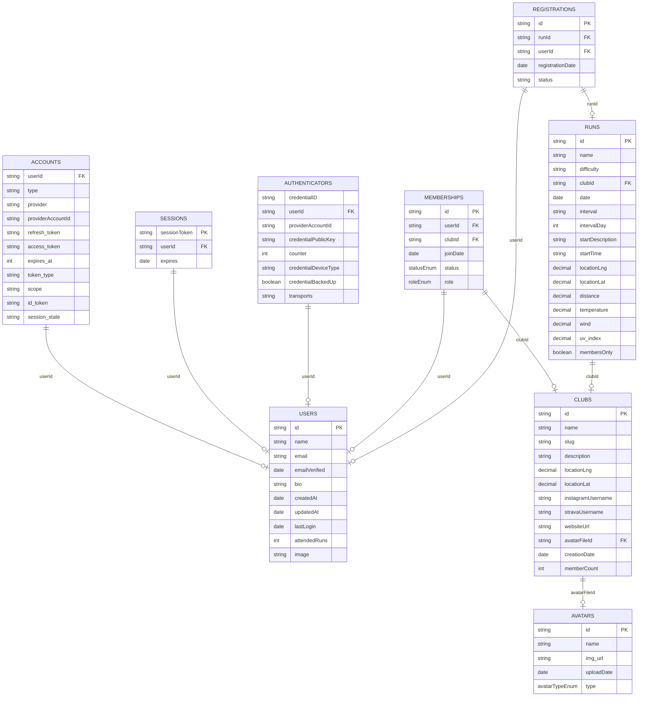

## Entity Relationship Diagram

```mermaid
erDiagram
    USERS {
        string id PK
        string name
        string email
        date emailVerified
        string bio
        date createdAt
        date updatedAt
        date lastLogin
        int attendedRuns
        string image
    }

    ACCOUNTS {
        string userId FK
        string type
        string provider
        string providerAccountId
        string refresh_token
        string access_token
        int expires_at
        string token_type
        string scope
        string id_token
        string session_state
    }
    ACCOUNTS ||--o| USERS : "userId"

    SESSIONS {
        string sessionToken PK
        string userId FK
        date expires
    }
    SESSIONS ||--o| USERS : "userId"


    AUTHENTICATORS {
        string credentialID
        string userId FK
        string providerAccountId
        string credentialPublicKey
        int counter
        string credentialDeviceType
        boolean credentialBackedUp
        string transports
    }
    AUTHENTICATORS ||--o| USERS : "userId"

    MEMBERSHIPS {
        string id PK
        string userId FK
        string clubId FK
        date joinDate
        statusEnum status
        roleEnum role
    }
    MEMBERSHIPS ||--o| USERS : "userId"
    MEMBERSHIPS ||--o| CLUBS : "clubId"

    CLUBS {
        string id PK
        string name
        string slug
        string description
        decimal locationLng
        decimal locationLat
        string instagramUsername
        string stravaUsername
        string websiteUrl
        string avatarFileId FK
        date creationDate
        int memberCount
    }
    CLUBS ||--o| AVATARS : "avatarFileId"

    REGISTRATIONS {
        string id PK
        string runId FK
        string userId FK
        date registrationDate
        string status
    }
    REGISTRATIONS ||--o| USERS : "userId"
    REGISTRATIONS ||--o| RUNS : "runId"

    RUNS {
        string id PK
        string name
        string difficulty
        string clubId FK
        date date
        string interval
        int intervalDay
        string startDescription
        string startTime
        decimal locationLng
        decimal locationLat
        decimal distance
        decimal temperature
        decimal wind
        decimal uv_index
        boolean membersOnly
    }
    RUNS ||--o| CLUBS : "clubId"

    AVATARS {
        string id PK
        string name
        string img_url
        date uploadDate
        avatarTypeEnum type
    }
```
